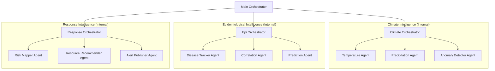

# EpiClimate HMAS

EpiClimate HMAS is a Hierarchical Multi-Agent System that predicts climate-driven disease outbreak risk by autonomously integrating live climate data with epidemiological knowledge using Google Gemini 2.0 Flash.

Built for the **Dallas Regional Science and Engineering Fair (DRSEF) 2027** by **Kush Bharadiya**.

## Architecture



## Key Features
- **Hierarchical Architecture**: 13 active components (1 main orchestrator, 3 sub-orchestrators, 9 specialist agents).
- **Real-Time Data**: Integrates Open-Meteo (Weather), WHO RSS, ProMED RSS, ReliefWeb, and GDELT News.
- **Gemini 2.0 Flash Grounding**: Agents use live Google Search grounding for scientific correlation and risk assessment.
- **ADK Integration**: Accessible via a modern Web UI using the Google Agent Development Kit (ADK).
- **Persistent Storage**: All predictions and reports are saved to a local SQLite database (`epiclimate.db`).

## Project Structure
- `epiclimate_hmas/`: Core package.
  - `agent.py`: ADK Root Agent definition.
  - `internal/`: Specialist agents and orchestrators.
- `docs/`: Technical documentation (Architecture, API Reference, Changelog).
- `tests/`: Automated test suite.
- `main.py`: Interactive CLI entry point.
- `database.py`: SQLite storage layer.
- `utils.py`: Shared utilities (Gemini client, geocoding, JSON parsing).

## Setup & Usage

### 1. Prerequisites
- Python 3.10+
- Gemini API Key (stored in `.env`)

### 2. Installation
```bash
pip install -r requirements.txt
```

### 3. Run Interactive CLI
```bash
python main.py
```

### 4. Run ADK Web UI
```bash
adk run epiclimate_hmas
```

## Documentation
- [System Architecture](docs/architecture.md)
- [API Reference](docs/api_reference.md)
- [Changelog](docs/changelog.md)
- [Project Specs](docs/project_specs.md)

## Project Info
**Student**: Kush Bharadiya  
**Grade**: 8th grade  
**Fair**: Dallas Regional Science and Engineering Fair (DRSEF) 2027
