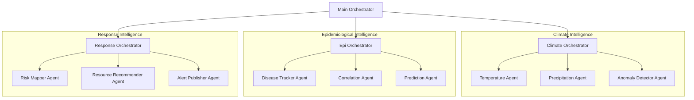

# EpiClimate HMAS

EpiClimate HMAS is a Hierarchical Multi-Agent System that predicts climate-driven disease outbreak risk by autonomously integrating live climate data with epidemiological knowledge using Google Gemini 2.0 Flash.

Climate change is actively expanding disease vectors into new regions. Over 4 billion people are at risk from climate-sensitive diseases. Between 2030–2050, climate change is projected to cause 250,000 additional deaths per year. Current early warning systems are reactive — they alert AFTER outbreaks begin. EpiClimate HMAS predicts outbreaks BEFORE they happen by reading climate signals weeks in advance.

## Architecture



## Setup

1. **Install dependencies**:
   ```bash
   pip install -r requirements.txt
   ```

2. **Configure API Key**:
   Create a `.env` file and add your Google Gemini API key:
   ```
   GEMINI_API_KEY=your_actual_key_here
   ```

3. **Run the system**:
   ```bash
   python main.py
   ```

## Science Fair Test Cases

| Case | Country | Disease | Year | Rationale |
| :--- | :--- | :--- | :--- | :--- |
| 1 | Brazil | Dengue | 2024 | Record 7.6M cases |
| 2 | Sudan | Cholera | 2023 | 252,000+ cases |
| 3 | Kenya | Malaria | 2023 | Spike in highlands |
| 4 | Bangladesh | Dengue | 2023 | Worst in decades |
| 5 | Mozambique | Cholera | 2023 | Post-cyclone outbreak |

## Research Question and Hypothesis

**Research Question**: Can a Hierarchical Multi-Agent AI System that autonomously integrates real-time climate data with historical epidemiological records predict the elevated risk of climate-driven disease outbreaks with greater accuracy and earlier lead time than a historical baseline model?

**Hypothesis**: An HMAS correlating climate anomalies with historical outbreak patterns will correctly identify elevated disease risk at least 4 weeks in advance with an accuracy greater than 60%, outperforming a baseline model that uses historical averages alone.

## Documentation

- [project_specs.md](docs/project_specs.md): Science fair specs, research Q, hypothesis.
- [architecture.md](docs/architecture.md): Full HMAS design, agent map, data flow.
- [api_reference.md](docs/api_reference.md): Every API, endpoints, params, response shapes.
- [experiment_design.md](docs/experiment_design.md): 5 test cases, variables, methodology.
- [changelog.md](docs/changelog.md): Version history — update after every session.

## Project Info

**Student**: Kush Bharadiya  
**Grade**: 8th grade  
**Fair**: Dallas Regional Science and Engineering Fair (DRSEF) 2027
